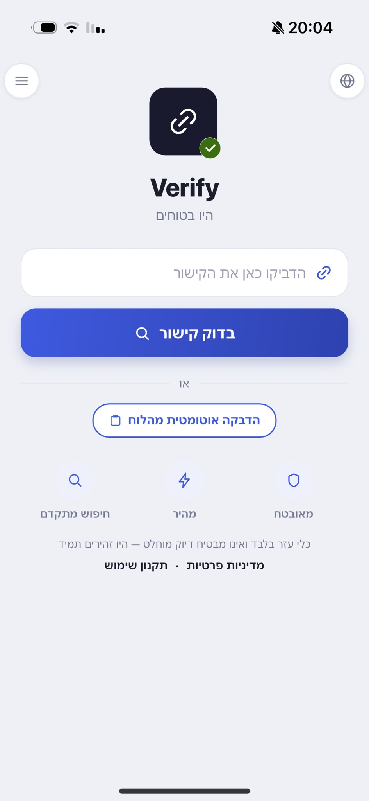
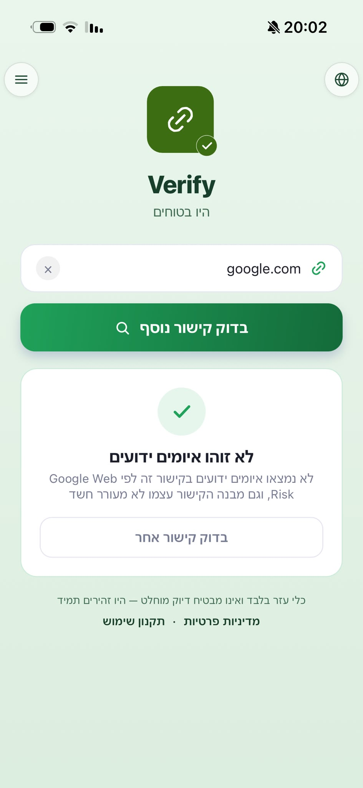
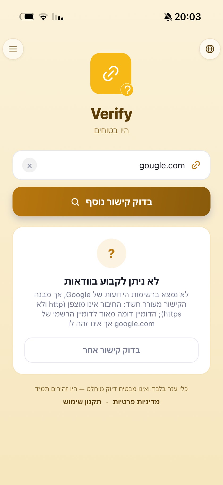
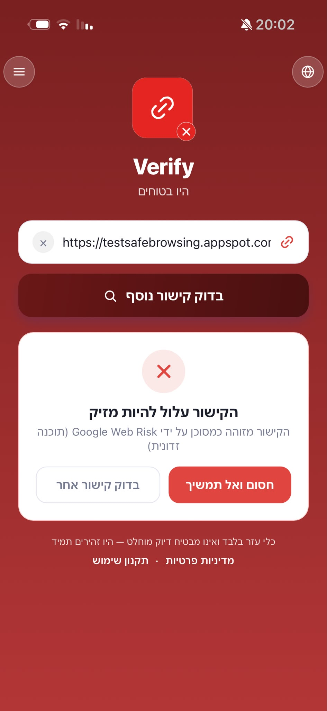

# Verify — Phishing Link Checker

A mobile app + backend that lets everyday users paste a link (from an
SMS, email, or WhatsApp message) and get an instant, color-coded
safety verdict, without ever leaving the app or exposing them to the
link itself. Fully localized (Hebrew, English, Russian, French,
Arabic) and built with screen-reader accessibility as a first-class
concern, not an afterthought.

**[Live Demo (PWA)](https://verifyweb-phi.vercel.app)** · **[Android APK](https://verifyweb-phi.vercel.app/link-checker.apk)**

## Screenshots

Three verdicts, not a single safe/unsafe toggle — the "uncertain"
state below is what a not-yet-catalogued, suspicious-looking domain
actually produces, distinct from both a confirmed threat and a clean
result.

<p align="center">
  
</p>

| 🟢 Safe | 🟡 Uncertain | 🔴 Dangerous |
|:---:|:---:|:---:|
|  |  |  |

## What it checks for, and how results are labeled

- 🟢 **No known threat detected** — not on any known threat list, and
  neither the link's structure nor its underlying infrastructure
  looks suspicious.
- 🔴 **Likely dangerous** — confirmed by Google Web Risk, or a strong
  structural red flag with no legitimate use (e.g. the `@`-trick, a
  raw IP address standing in for a domain).
- 🟡 **Uncertain** — not yet catalogued as a known threat, but the
  link's structure or infrastructure raises some suspicion. Treated
  as "be careful," not "safe."

(Deliberately not calling anything "guaranteed safe" — see *Why this
project is interesting* below for why.)

## What I built

- React Native (Expo) mobile client — PWA, Android APK, and
  Android share-intent support (share a link/message straight into
  the app from Messages, WhatsApp, etc.)
- Serverless Node.js backend on Vercel
- **Three independent detection signals**, not one: Google Web Risk,
  a structural URL heuristic, and a DNS/infrastructure risk layer
  (see below)
- Full 5-language localization (he/en/ru/fr/ar), with RTL support
- Screen-reader accessibility: roles, labels, and live-region result
  announcements throughout the main flow
- First-launch terms/consent screen, and a hosted, publicly-linked
  privacy policy page (required for app-store submission)
- Redirect resolution + SSRF protection
- Per-IP rate limiting, shared-secret request auth, and privacy-
  conscious usage stats, all backed by Upstash Redis
- 145 automated tests across two suites (backend detection logic +
  API behavior, and URL extraction), zero live network calls
  required to run either

## Why this project is interesting (the engineering decisions)

- **Secure server-side API key handling.** The Google API key lives
  only as a server-side environment variable on Vercel — never in
  the client bundle, so it can't be extracted by unpacking the app.
- **Three independent detection signals, combined into one score.**
  Google Web Risk only knows about *already-catalogued* threats. A
  structural heuristic (typosquatting via edit-distance, registrable-
  domain-aware brand/subdomain-decoy detection, Unicode homoglyph
  detection, encoding-obfuscation detection, and more) and a separate
  DNS/infrastructure layer (RDAP domain age, private-IP destination
  detection) each contribute signals that fold into one scoring
  system — not three competing verdicts.
- **A deliberately conservative trust model.** Only three patterns
  with *no legitimate use whatsoever* (the userinfo `@` trick, a raw
  IP address, a private/internal address the backend itself refused
  to connect to) are allowed to force a "dangerous" verdict outright.
  Every other signal — however strong — only ever raises a numeric
  score, never bypasses Web Risk's own judgment. This was a deliberate
  design choice to keep false positives low, not an oversight.
- **A latency-conscious race pattern.** Web Risk and the
  infrastructure layer run *concurrently*, not sequentially — but if
  Web Risk already confirms "dangerous," the response returns
  immediately without waiting on infrastructure at all, since no
  infrastructure signal could ever override a confirmed threat. The
  infrastructure lookup is deliberately left to finish or be dropped
  in the background rather than adding an `AbortController` just to
  cancel work whose result would never be used.
- **SSRF-aware redirect resolution, with an explicit TOCTOU
  boundary.** The backend resolves redirects itself (to catch
  shortened links) and refuses to follow one into a private/loopback/
  link-local address *before ever connecting to it* — a real
  guarantee. The infrastructure layer's own DNS lookup, by contrast,
  is independent of that connection and can't make the same
  guarantee (a classic DNS-rebinding TOCTOU window) — so a
  private/internal IP found *only* there is scored as a strong
  signal, but is explicitly never allowed to force a "dangerous"
  verdict on its own. The distinction is documented inline at the
  exact line where it matters, not just in a design doc.
- **Rate limiting + fail-safe error handling.** The public endpoint
  is protected from abuse of the free API quota, and any failure
  anywhere in the chain — Web Risk, DNS, RDAP — degrades gracefully
  to a cautious result instead of crashing or hanging; the user is
  never left without an answer.

Two more decisions are worth spelling out, because they came up in
actual product tradeoffs:

A **"safe" verdict from Web Risk still gets checked against the other
two layers before being trusted outright** — Web Risk is a list
lookup, not live content analysis, so a brand-new phishing link or a
freshly-compromised legitimate site won't be on it yet. Trusting it
blindly would give users false confidence.

**Web Risk, not Safe Browsing v4** — Safe Browsing is free but
explicitly forbids commercial use and is officially deprecated. Web
Risk is the supported, commercially-usable successor, chosen
deliberately for a project meant to be maintained long-term.

## Tech stack

| Layer      | Choice                                          |
|------------|--------------------------------------------------|
| Frontend   | React Native (Expo SDK 54), PWA + Android APK targets |
| Backend    | Node.js serverless functions on Vercel (Hobby/free tier) |
| Threat API | Google Web Risk API                             |
| Domain intelligence | `psl` (registrable-domain / Public Suffix List parsing), `punycode` (IDN homoglyph decoding), `ipaddr.js` (private/reserved IP classification), public RDAP (domain age) |
| Rate limiting / stats | Upstash Redis (free tier)            |
| Build      | EAS Build (free tier, internal distribution)     |
| Tests      | Custom test runner (`test.mjs`), mocked `fetch`/DNS/RDAP, no live network calls |

## Architecture

```
                         [Expo app: PWA / APK / share-intent]
                                       │
                                POST {link, lang}
                                       ▼
                          [Vercel /api/check-link]
                                       │
                        resolve redirects (SSRF-guarded)
                                       │
                    ┌──────────────────┼──────────────────┐
                    ▼                  ▼                  ▼
             structural           Google Web Risk     DNS / RDAP
             heuristic          (runs concurrently    infrastructure
          (typosquatting,        with infra layer —    layer (private-IP
           homoglyphs,           "dangerous" returns    destination,
           encoding, ...)        immediately, does      domain age)
                    │             not wait on infra)         │
                    └──────────────────┬──────────────────┘
                                       ▼
                              combined score / reasons
                                       ▼
                          safe · uncertain · dangerous
```

Backend API (for reference, not meant for direct browsing):
`https://verifyapp-khaki.vercel.app/api/check-link`

## What the backend actually does (`api/check-link.js`)

1. Validates the request is `POST` with a non-empty `link` string,
   checks the (optional) shared-secret header, and enforces per-IP
   rate limiting.
2. Normalizes the URL and **resolves redirects** (up to 5 hops) so a
   shortened link gets checked at its *real* destination.
3. Refuses to follow a redirect into a private/loopback/link-local
   address (SSRF guard) — before any connection is attempted.
4. Starts the Google Web Risk lookup and the DNS/infrastructure
   analysis (`api/_lib/infrastructure.js`) concurrently.
5. If Web Risk confirms "dangerous," returns immediately — no
   infrastructure signal could change that outcome anyway.
   Otherwise, waits for the infrastructure result and combines it
   with the structural heuristic's score into one verdict.
6. Any failure anywhere in that chain degrades to a cautious
   `"unknown"`/`"uncertain"` result with a `200` — the app never
   crashes or hangs, and DNS/RDAP unavailability (which is expected
   and silent for some TLDs — see `infrastructure.js`) is never
   itself treated as suspicious.
7. Records privacy-conscious, aggregate-only usage stats (no link
   content, no raw IP) via Upstash Redis.

## Security notes

- **SSRF guard is a literal-hostname check on the connection
  `resolveFinalUrl()` itself makes**, not a DNS-resolution check — a
  real, pre-connection guarantee. The DNS/infrastructure layer's own
  independent lookup is a *separate*, best-effort signal with a
  documented TOCTOU limitation (see above) — it strengthens the
  score but is deliberately never treated as equivalent proof.
- **CORS is restricted to the deployed PWA origin** (and its Vercel
  preview deployments, and localhost for development) rather than
  wide open — the API itself remains usable by the native app
  regardless, since CORS is a browser-only mechanism.
- **Rate limiting + shared secret** protect the public endpoint from
  casual abuse of the free Web Risk/RDAP quotas.

## Setup & deployment

The full step-by-step deployment guide (Google Cloud setup, Vercel
deployment, Expo wiring) lives in [`DEPLOYMENT.md`](./DEPLOYMENT.md).

## License

MIT — see [LICENSE](./LICENSE).
